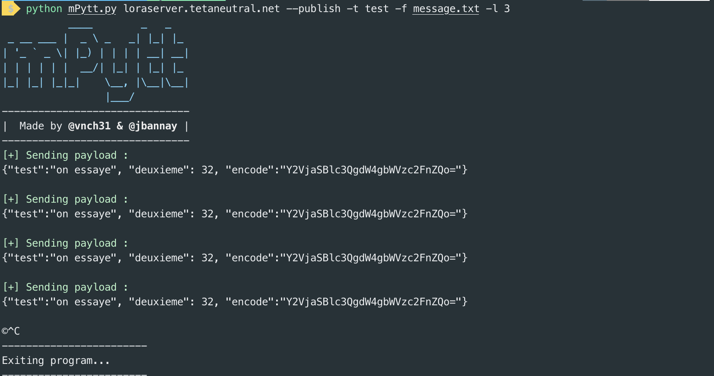

# mpytt

-------

mpytt is a  simple MQTT (version 5/3.1.1) open source client, that can subscribe or publish to topics. It's written in python with the paho library

In addition you can also filter received message (`-k` option), and decode if it's in base64 (`-d`option). You also can save the output into a file or even publish repeating messages from a file. (See the options sectionfor details)

## Screenshots

--------

Subscribe example : 


Publish example :



## Installation

------

Step to follow : 

1. `git clone https://github.com/vnch31/mpytt.git`
2. `cd mpytt`
3. `pip3 install -r requirements.txt`

mpytt works with python 3.x on unix based platforms

It has not been tested on Windows.

## Usage

-------

To get a list of basic options and switches use : 

```bash
python3 mpytt.py -h
```

Basic use of subscribe :

```bash
python3 mpytt.py <broker>
```

By default you will subscribe to all the topics `#`but you can also specify the topic to connect to by adding the option `-t <topic>`

**Note:** You must specify the broker to connect to as the first argument

**Note:** By default, if you don't use `--publish` argument, the programm will subscribe.

Basic use of publish :

```bash
python3 mpytt.py <broker> -t <topic> [-m <message> | -f <file>]
```

To publish you must specify the broker, `-t`the topic but also the payload with `--payload` or the file to use to send `-f`

## Options

-------

`-h` or `--help`  : Display help informations and options.

#### General options :

`-p ` or `--port`: Connect to the port specified. If not filled, the default MQTT port is used.

`-t` or  `--topic` : The MQTT topic to subscribe to.

#### Subscribe options :

`-v` or `--value` : Allow to customise the displayed values (single to multiple). By delfault all values are displayed. 

`-d` or `--decode`: Allows to decode base64 encoding values, if `-v`is specified the value to decode will be printed in addition to the value specified in the `-v`arguments, if not only the `-d` specified value will be printed and decoded.

`-r`or `--raw` : The received payload will be raw printed ie printed as received. The banner is not printed in this case, you can then pipe the output to use it elsewhere.

`-s`or `--save` : The output will be save as raw in a file. The file is automatically created with the following syntax `<mmm>-<day>-<year>-<hour>:<minutes>.txt` for example : `mpyttApr-01-2020-11:45.txt`

#### Publish options :

------

**First if you want to publish you must specify the argument : **

`--publish`

To publish, minimum two arguments are required : 

`-t`  `--topic`

and 

`--payload` or `-f` (`--file`)

---------

`--payload`: the payload to send to the broker

`-f`or `--file` : if specified the payload will be sent from the file content

`-l`or `--loop`: Send the payload to the broker in repeat mode every <seconds> specified.

## Example of use : 

------

#### Subscribe : 

````bash
python mPytt.py loraserver.tetaneutral.net -t gateway/+/stats/#
````

```bas
python mPytt.py loraserver.tetaneutral.net -t gateway/+/stats/# -v ip -d phyPayload
```

#### Publish : 

```bash
python mPytt.py loraserver.tetaneutral.net --publish --payload '{"test":"test"}' -t test -l 2
```

```bash
python mPytt.py loraserver.tetaneutral.net --publish -t test -f message.txt
```

## 

### Note

--------

Want to get rid off the banner ? yes you can remove it : 

1. In the subscribe function, by commenting or removing these 2 lines

```py
def subscribe():
		.....
    #if not args.raw:
    #   print_banner()
    .......
```


2. In the publish function, by commenting or removing these 2 lines

```pyt
def publish():
		.....
    if not args.raw:
        print_banner()
    .....
```


### Contributing to the project

Contributions to the project are welcome !!

Developp your functionalities and merge it, I will add the most relevant for all users.

